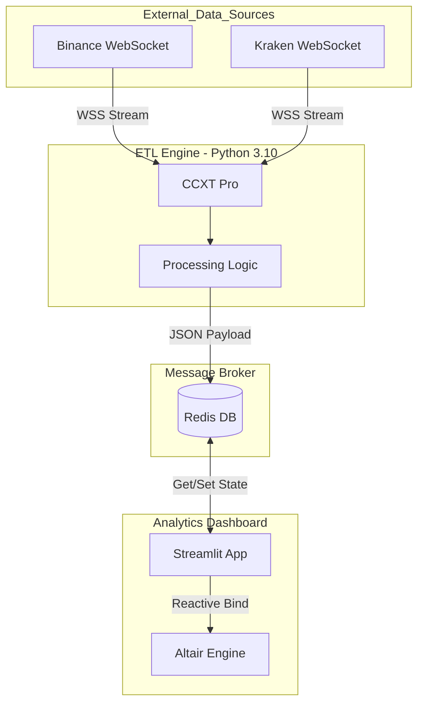
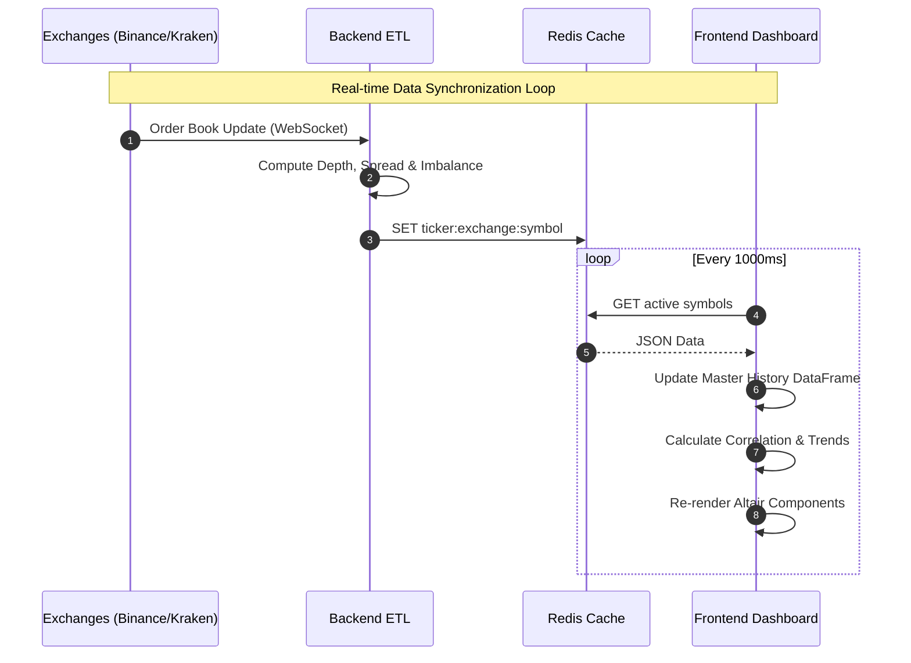
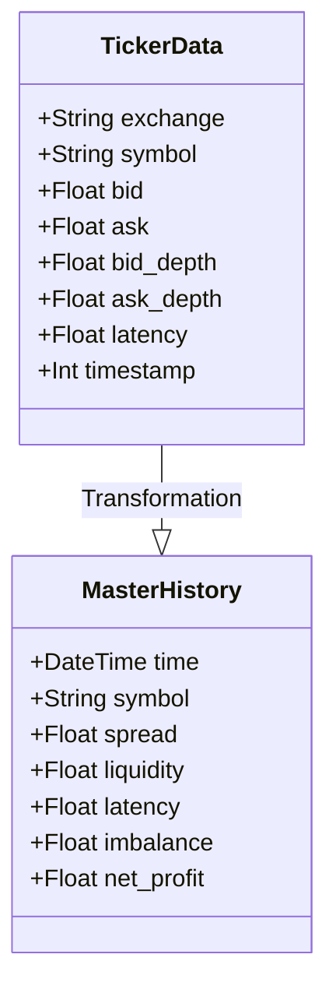
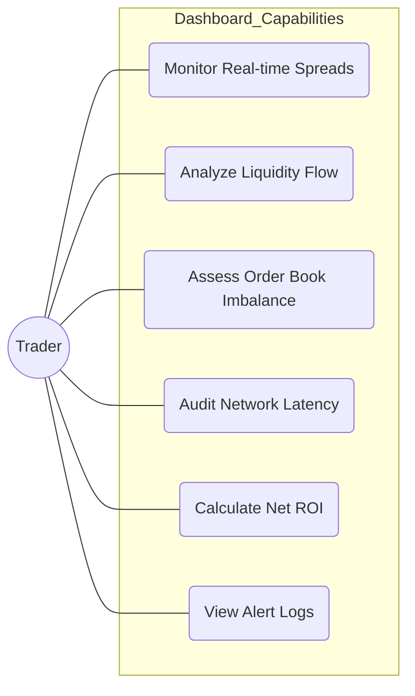

# Crypto Arbitrage Stealth Engine

A high-frequency Real-Time ETL pipeline designed to monitor and visualize arbitrage opportunities across multiple cryptocurrency exchanges using **WebSockets**, **Redis**, and **Docker**.


## System Architecture

The project follows a microservices architecture to ensure low latency and scalability:



1. **ETL Engine (Python/CCXT Pro)**: Connects to Binance and Kraken via WebSockets. It performs real-time data ingestion, calculates order book depth/imbalance, and pushes normalized data to Redis.
2. **Message Broker (Redis)**: Acts as an ultra-fast in-memory data store, serving as the "Single Source of Truth" for the frontend.
3. **Analytics Dashboard (Streamlit/Altair)**: A reactive web interface that performs complex analytics, including correlation matrices and market intelligence insights.



## Tech Stack

- **Backend**: Python 3.10 (Asyncio)
- **Exchange Integration**: CCXT Pro (WebSockets)
- **Infrastructure**: Docker & Docker Compose
- **Database**: Redis (In-memory caching)
- **Visualization**: Streamlit & Altair (Declarative Statistical Visualization)

## Data Schema



## Advanced Features



- **Market Intelligence Insights**: Real-time automated analysis of execution risk, network latency, and buying pressure.
- **Correlation Heatmap**: Dynamic matrix showing the price spread relationships between different assets.
- **Order Book Imbalance**: Visualizes Bid vs. Ask pressure to predict short-term price movements.
- **Analytics**:
  - **Live Spreads & Trends**: Real-time delta tracking with directional trend indicators (▲/▼).
  - **Liquidity Flow**: Multi-line tracking of market depth across all monitored symbols.
  - **Net Profit Calculator**: Instant calculation of ROI after exchange fees and investment size.
- **Alert Log**: Persistent session logging of every profitable arbitrage window detected.

## Getting Started

### Prerequisites

- Docker & Docker Compose installed.

### Installation

1. Clone the repository:

```bash
git clone [https://github.com/YOUR_USERNAME/Crypto-Arbitrage-Stealth.git](https://github.com/YOUR_USERNAME/Crypto-Arbitrage-Stealth.git)
cd Crypto-Arbitrage-Stealth
```

2. Launch the entire stack:

```bash
docker-compose up --build
```

3. Access the dashboard:
Open <http://localhost:8501> in your browser.
